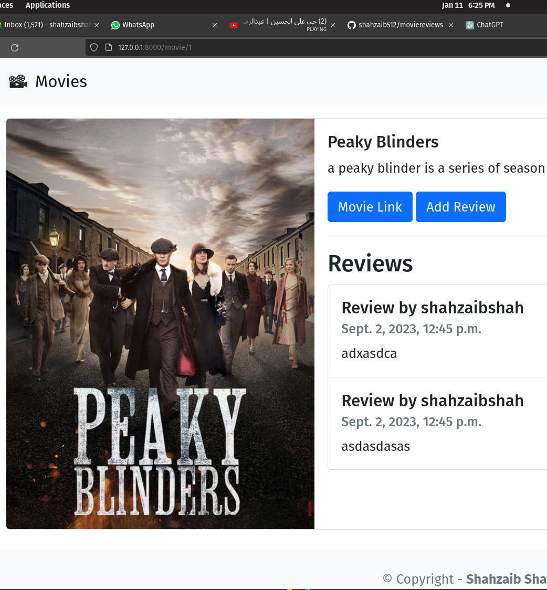

## Project Overview

This Django project, a showcase of my web development skills, encompasses various features to provide a seamless movie review experience. Below are key components illustrated through screenshots:

### Home Page

Efficiently designed home page, offering an intuitive and user-friendly interface for easy navigation.

### Detailed Page

Detailed movie view, providing in-depth information and a rich user experience.

### Review Page

Dynamic review page allowing users to share their thoughts and opinions on movies.

### Search Page

Robust search functionality, enhancing user accessibility and content discovery.

### Navbar

Streamlined navigation through a responsive and visually appealing navigation bar.

### Home Page (Alternate)

Alternate view of the home page, ensuring versatility in design.

### News Page

Integrated news section to keep users updated on the latest in the world of movies.

Feel free to explore the application, and for more details, refer to the respective sections. This project showcases my proficiency in Django and my commitment to delivering exceptional user experiences.
